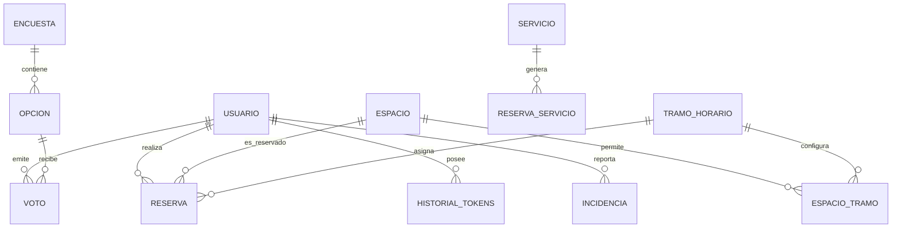

<div align="center">
  
  <h1>🚀 RESERVIVES APP</h1>
  <p><strong>Ecosistema inteligente para la gestión de recursos, espacios y servicios académicos.</strong></p>

  <p>
    
    
    
    
  </p>
</div>

---

## 📖 Sobre el Proyecto

**Reservives** es una aplicación diseñada para simplificar y modernizar el proceso de reserva de espacios, equipos y recursos para estudiantes y profesores del IES Luis Vives. El sistema centraliza la gestión de pistas deportivas, aulas, servicios de departamentos y el tablón de anuncios, todo bajo un entorno seguro con autenticación **Microsoft OAuth**.

---

## 🏗 Estructura

El proyecto se divide en diferentes directorios principales:

```text
📦 RESERVIVES-APP
 ┣ 📂 backend            # API RESTFUL construida con FastAPI (Python) & SQLAlchemy
 ┣ 📂 frontend           # Interfaz de usuario construida con Flutter y Riverpod 3.3.1
 ┣ 📂 database           # Ficheros de inicialización y migración (PostgreSQL)
 ┗ 📜 docker-compose.yml # Orquestación de múltiples contenedores
```
---

## 🛠 Stack Tecnológico

### 🎨 Frontend (Client)
| Componente | Tecnología | Versión | Propósito |
| :--- | :--- | :--- | :--- |
| **Lenguaje** | Dart | `^3.11.3` | Lenguaje principal UI |
| **Framework** | Flutter | `Latest Stable` | Desarrollo Multiplataforma (Web/Mobile) |
| **Estado** | Riverpod | `^3.3.1` | Gestión de estado reactiva y asíncrona |
| **Navegación** | GoRouter | `^17.1.0` | Enrutamiento declarativo |
| **Estilos** | Google Fonts | `^8.0.2` | Tipografía moderna (Inter/Outfit) |
| **Animaciones** | Flutter Animate| `^4.5.0` | Micro-interacciones premium |
| **Notificaciones**| Firebase Cloud Messaging | `^16.0.1` | Push notifications en tiempo real |

### ⚙️ Backend (Server)
| Componente | Tecnología | Versión | Propósito |
| :--- | :--- | :--- | :--- |
| **Lenguaje** | Python | `3.12` | Lógica de negocio |
| **Framework** | FastAPI | `0.115.8` | API RESTful de alto rendimiento |
| **ORM** | SQLAlchemy | `2.0.37` | Mapeo objeto-relacional asíncrono |
| **Validación** | Pydantic | `2.10.6` | Esquemas de datos y validación |
| **Seguridad** | MSAL / Jose | `1.31.1 / 3.3.0` | Microsoft EntraID & JWT Auth |
| **Task Runner** | APScheduler | `3.11.0` | Tareas programadas (Recarga de tokens) |
| **DB Driver** | Asyncpg | `0.30.0` | Driver PostgreSQL asíncrono |

---

## 🏗 Arquitectura del Software

El proyecto implementa una **Arquitectura Cliente-Servidor Multicapa**:

### 🌐 Backend
El flujo de datos en el servidor sigue el patrón:
1.  **Router Layer**: Define los endpoints y parsea las peticiones (FastAPI).
2.  **Service Layer**: Contiene la lógica de negocio pura (validaciones complejas, cálculos).
3.  **Repository Layer**: Abstracción de acceso a datos (Querying con SQLAlchemy).
4.  **Model Layer**: Definición de entidades de base de datos y esquemas Pydantic.

### 📱 Frontend
Utiliza una estructura de carpetas basada en dominios funcionales:
-   `providers/`: Controladores de estado que exponen datos a la UI.
-   `services/`: Clientes HTTP que consumen la API del backend.
-   `screens/` & `widgets/`: Capa de presentación desacoplada de la lógica.

---

## 📊 Base de Datos

El motor principal es **PostgreSQL 16**, optimizado con extensiones como `btree_gist` para el control estricto de solapamientos horarios mediante restricciones de exclusión nativas.

### 📑 Diccionario de Datos (Principales Entidades)

| Tabla | Descripción | Clave Primaria | Relaciones Clave |
| :--- | :--- | :--- | :--- |
| `usuarios` | Perfiles de alumnos y profesores. | `id (UUID)` | - |
| `espacios` | Recursos físicos (Aulas, Pistas). | `id (UUID)` | - |
| `reservas` | Control de ocupación de espacios. | `id (UUID)` | `usuario_id`, `espacio_id`, `tramo_id` |
| `servicios_instituto` | Servicios de FP (Peluquería, etc). | `id (UUID)` | - |
| `historial_tokens` | Auditoría de movimientos económicos. | `id (UUID)` | `usuario_id` |
| `tramos_horarios` | Definición de periodos lectivos. | `id (UUID)` | - |
| `encuestas` | Sistema de votaciones y feedback. | `id (UUID)` | - |

### 🗺 Diagrama de Entidad-Relación



---

## 🚀 Guía de Configuración Local

### 📋 Requisitos Previos
*   **Docker & Docker Compose** (Recomendado para despliegue rápido).
*   **Flutter SDK** (3.11.x+) para desarrollo UI.
*   **Python 3.12**.

### 🔑 Variables de Entorno (.env.example)
Crea un archivo `.env` en `backend/` con la misma estructura que el archivo `.env.example` poniendo tus credenciales de OAtuh2 y Firebase.


### 🛠 Comando de Ejecución

#### Orquestación con Docker (Full Stack)
```bash
# Levanta BD, Backend y Frontend Web simultáneamente
docker-compose up -d --build
```
---

## 👥 Créditos y Autoría

Este proyecto ha sido posible gracias al trabajo de dos equipos en diferentes etapas:

### 🚀 Inicio del Proyecto (Versión Original)
Desarrollado inicialmente por:

- [Alejandro Sánchez Monzón](https://github.com/AlejandroSanchezMonzon)
- [Mireya Sánchez Pinzón](https://github.com/Mireyasanche)
- [Rubén García-Redondo Marín](https://github.com/RuyMi)

### 🏁 Finalización y Versión Actual
Evolución, rediseño y despliegue final por:

- [Gonzalo Santiago Ariza](https://github.com/gonnzaxx)
- [Álvaro Lorenzo Carrillo](https://github.com/lorenZZo30)
- [Jorge Sepúlveda Martín](https://github.com/JorgeSepul)

---

## 📚 Documentación

- [Anteproyecto](https://github.com/RuyMi/tfg-gestion-espacios/blob/main/metadata/Anteproyecto.pdf)
- [Documentación del proyecto](https://github.com/RuyMi/tfg-gestion-espacios/blob/main/Proyecto%20Desarrolo%20de%20aplicaciones_IES%20Luis%20Vives.pdf)

---

<div align="center">
  <sub>Desarrollado con ❤️ para la comunidad educativa del IES Luis Vives.</sub>
</div>

