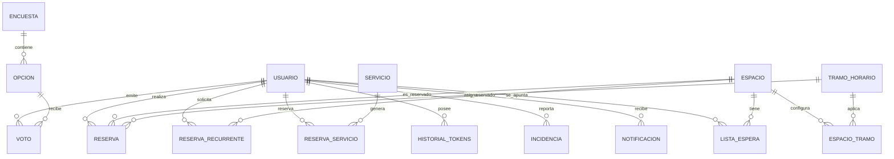

<div align="center">
  
  <h1>IES Luis Vives App</h1>
  <p><strong>Plataforma integral de gestión de reservas y recursos para el IES Luis Vives.</strong></p>

  <p>
    
    
    
    
    
    
  </p>

  <p>
    
    
  </p>
</div>

---

## Índice

- [Sobre el Proyecto](#-sobre-el-proyecto)
- [Funcionalidades](#-funcionalidades)
- [Stack Tecnológico](#-stack-tecnológico)
- [Arquitectura](#-arquitectura)
- [Base de Datos](#-base-de-datos)
- [Despliegue](#-despliegue)
- [Configuración Local](#-configuración-local)
- [Créditos](#-créditos)

---

## Sobre el Proyecto

**Reservives** es una aplicación web y móvil diseñada para modernizar y centralizar la gestión de recursos del IES Luis Vives. Permite a alumnos y profesores reservar espacios (aulas, pistas deportivas), acceder a los servicios del instituto (peluquería, departamentos, etc.) y consultar el tablón de anuncios, todo desde una única plataforma segura autenticada con **Microsoft EntraID (Azure AD)**.

El sistema implementa un **modelo de tokens** como moneda interna que regula el acceso a los recursos, junto con flujos de aprobación para reservas que requieren autorización explícita.

---

## Funcionalidades

### Autenticación y Usuarios

- Login seguro mediante **Microsoft EntraID (OAuth2 / OIDC)**.
- Modo invitado con acceso restringido a contenido público.
- Gestión de roles: `ADMIN`, `JEFE_ESTUDIOS`, `PROFESOR`, `ALUMNO`.
- Perfil de usuario con historial de actividad y saldo de tokens.
- Administración completa de usuarios desde el panel de administración.

### Sistema de Tokens

- Cada usuario dispone de un saldo de tokens que consume al realizar reservas.
- **Recarga automática mensual** el día 1 de cada mes (tarea programada).
- El administrador puede ajustar manualmente el saldo de cualquier usuario con un motivo registrado.
- Configuración global de tokens iniciales y de recarga por rol desde el panel de administración.
- Auditoría completa del historial de movimientos de tokens por usuario.

### Espacios

- Catálogo de espacios físicos del instituto: aulas, pistas deportivas y otros recursos.
- Filtrado por tipo, capacidad y disponibilidad.
- **Calendario de disponibilidad** semanal por espacio (rango de 14 días).
- Sistema de reserva individual con deducción automática de tokens y notificaciones.
- **Reservas recurrentes** (diarias, semanales, mensuales) sujetas a aprobación por el administrador.
- **Lista de espera**: los usuarios pueden apuntarse cuando un tramo está ocupado y reciben una notificación automática si se libera una plaza.
- CRUD completo de espacios y control de acceso por rol desde el backoffice.

### Servicios del Instituto

- Catálogo de servicios ofrecidos por los departamentos del instituto (peluquería, etc.).
- Reserva de servicios con flujo de aprobación (pendiente → aprobada / rechazada).
- Gestión completa de servicios desde el panel de administración.
- Notificaciones push, email y en app en cada cambio de estado.

### Favoritos

- Los usuarios pueden marcar espacios y servicios como favoritos para acceder a ellos rápidamente.

### Tablón de Anuncios

- Publicación de anuncios con fecha de expiración configurable.
- Anuncios destacados con mayor visibilidad.
- Limpieza automática de anuncios expirados (tarea programada nocturna).
- Notificación push al publicar nuevos anuncios.

### Cafetería

- Menú digital con categorías y productos del comedor escolar.
- Marcado de productos como destacados.
- Gestión completa del menú desde el backoffice (categorías, productos, estados activo/inactivo).

### Encuestas

- Creación de encuestas con múltiples opciones (Admin).
- Votación única por usuario con cierre automático por fecha límite.
- Visualización de resultados en tiempo real.
- Notificación push al publicar nuevas encuestas.

### Incidencias

- Los usuarios pueden reportar incidencias con descripción e imagen adjunta.
- Seguimiento de estado: `PENDIENTE` → `EN_REVISIÓN` → `RESUELTA`.
- Notificación al usuario cuando su incidencia es gestionada o resuelta.
- Revisión y comentarios del administrador desde el backoffice.

### Asistente IA

- Chat integrado con un asistente de inteligencia artificial (Gemini).
- Límite de uso configurable (10 peticiones por minuto por usuario).
- Validación de longitud de mensajes.

### Notificaciones

- Sistema multicanal: **notificaciones en app**, **email** y **push (FCM)**.
- Bandeja de notificaciones con contador de no leídas.
- Marcado individual o masivo como leída.
- Registro de tokens de dispositivo para notificaciones push en iOS y Android.

### Tiempo Real (WebSockets)

- Canal WebSocket para usuarios autenticados con actualizaciones en tiempo real del estado de sus reservas.
- Canal WebSocket exclusivo para administradores con eventos globales del sistema.

### Panel de Administración (Backoffice)

- **Dashboard** con KPIs de uso: aulas, pistas, servicios y anuncios.
- Historial global de reservas con filtros por fecha, estado, tipo y búsqueda de usuario.
- Cancelación de reservas desde el backoffice con motivo obligatorio.
- Gestión de usuarios, roles y saldos de tokens.
- Gestión de tramos horarios, espacios, servicios, anuncios, cafetería, encuestas e incidencias.
- Configuración global del sistema (SMTP, tokens, días de caducidad de anuncios, etc.).

### Internacionalización

- Interfaz disponible en **Español**, **Inglés** y **Francés**.
- Sistema de localización propio basado en archivos JSON con fallback automático al español.

---

## Stack Tecnológico

### Frontend

| Componente | Tecnología | Versión | Propósito |
| :--- | :--- | :--- | :--- |
| Lenguaje | Dart | `^3.11.3` | Lenguaje principal |
| Framework | Flutter | `3.41.5` | Desarrollo multiplataforma (Web / iOS / Android) |
| Estado | Riverpod | `^3.3.1` | Gestión de estado reactiva y asíncrona |
| Navegación | GoRouter | `^17.1.0` | Enrutamiento declarativo con guards |
| HTTP | http | `^1.2.2` | Cliente HTTP para consumo de la API |
| Auth | oauth2_client | `^4.3.0` | Flujo OAuth2 con Microsoft EntraID |
| Push | Firebase Cloud Messaging | `^16.0.1` | Notificaciones push en tiempo real |
| Animaciones | Flutter Animate | `^4.5.0` | Micro-interacciones |
| Tipografía | Google Fonts | `^8.0.2` | Inter / Outfit |

### Backend

| Componente | Tecnología | Versión | Propósito |
| :--- | :--- | :--- | :--- |
| Lenguaje | Python | `3.12` | Lógica de negocio |
| Framework | FastAPI | `0.115.8` | API RESTful asíncrona |
| ORM | SQLAlchemy | `2.0.37` | Mapeo objeto-relacional asíncrono |
| Validación | Pydantic | `2.10.6` | Esquemas y validación de datos |
| Auth | MSAL / python-jose | `1.31.1 / 3.3.0` | Validación de tokens Microsoft y JWT |
| Scheduler | APScheduler | `3.11.0` | Tareas programadas (tokens, limpieza) |
| DB Driver | asyncpg | `0.30.0` | Driver PostgreSQL asíncrono |
| IA | Google Generative AI | `^0.8` | Integración con Gemini |
| Email | aiosmtplib | — | Envío de notificaciones por email |

### Infraestructura

| Componente | Tecnología | Propósito |
| :--- | :--- | :--- |
| Base de datos | PostgreSQL 16 | Almacenamiento principal |
| Contenedores | Docker + Docker Compose | Orquestación de servicios |
| Proxy inverso | Traefik | Terminación TLS y enrutamiento HTTPS |
| Servidor web | Nginx (Alpine) | Servir el frontend Flutter Web |
| Push | Firebase (FCM) | Notificaciones push multiplataforma |

---

## Arquitectura

### Visión General

```
                        Internet
                           │
                    ┌──────▼──────┐
                    │   Traefik   │  Puerto 2121 (HTTPS) → Frontend
                    │ (TLS Proxy) │  Puerto 1212 (HTTPS) → Backend
                    └──────┬──────┘
                           │
             ┌─────────────┴──────────────┐
             │                            │
      ┌──────▼──────┐             ┌───────▼──────┐
      │   Frontend  │             │   Backend    │
      │  Flutter +  │             │  FastAPI +   │
      │    Nginx    │             │   Uvicorn    │
      └─────────────┘             └───────┬──────┘
                                          │ Red interna
                                  ┌───────▼──────┐
                                  │  PostgreSQL  │
                                  │   (Docker)   │
                                  └──────────────┘
```

### Backend — Capas

```
Router Layer     →  Define endpoints, parsea y valida peticiones (FastAPI)
Service Layer    →  Lógica de negocio pura (validaciones, cálculos, tokens)
Repository Layer →  Abstracción de acceso a datos (SQLAlchemy async)
Model Layer      →  Entidades de base de datos y esquemas Pydantic
```

### Frontend — Estructura de carpetas

```
lib/
 ┣ config/         # Tema, rutas, constantes y variables de entorno
 ┣ core/           # Utilidades transversales (roles, guards, helpers)
 ┣ i10n/           # Sistema de internacionalización y archivos de idioma
 ┣ models/         # Modelos de dominio
 ┣ providers/      # Estado reactivo (Riverpod)
 ┣ screens/        # Pantallas organizadas por dominio funcional
 ┣ services/       # Cliente HTTP y comunicación con la API
 └ widgets/        # Componentes reutilizables del sistema de diseño
```

---

## Base de Datos

Motor principal: **PostgreSQL 16** con la extensión `btree_gist` para control estricto de solapamientos horarios mediante restricciones de exclusión nativas.

### Entidades principales

| Tabla | Descripción |
| :--- | :--- |
| `usuarios` | Perfiles de alumnos y profesores con saldo de tokens y rol |
| `espacios` | Recursos físicos reservables (aulas, pistas…) |
| `reservas` | Ocupación de espacios por usuario y tramo horario |
| `reservas_recurrentes` | Patrones de reserva periódica sujetos a aprobación |
| `lista_espera` | Cola de espera por tramo y espacio |
| `servicios_instituto` | Servicios ofertados por los departamentos |
| `reservas_servicios` | Reservas de servicios con flujo de aprobación |
| `favoritos_espacios` | Relación usuario ↔ espacio favorito |
| `favoritos_servicios` | Relación usuario ↔ servicio favorito |
| `tramos_horarios` | Definición de periodos lectivos |
| `anuncios` | Publicaciones del tablón con expiración |
| `cafeteria_categorias` | Categorías del menú del comedor |
| `cafeteria_productos` | Productos con precio y estado activo |
| `encuestas` | Votaciones con opciones y fecha límite |
| `votos` | Registro de votos por usuario y encuesta |
| `incidencias` | Reportes de problemas con seguimiento de estado |
| `historial_tokens` | Auditoría de todos los movimientos de tokens |
| `notificaciones` | Bandeja de notificaciones por usuario |
| `configuracion` | Pares clave-valor para la configuración global |

### Diagrama Entidad-Relación


```mermaid
erDiagram
    USUARIO ||--o{ RESERVA : realiza
    USUARIO ||--o{ RESERVA_RECURRENTE : solicita
    USUARIO ||--o{ RESERVA_SERVICIO : reserva
    USUARIO ||--o{ HISTORIAL_TOKENS : posee
    USUARIO ||--o{ INCIDENCIA : reporta
    USUARIO ||--o{ NOTIFICACION : recibe
    USUARIO ||--o{ VOTO : emite
    USUARIO ||--o{ LISTA_ESPERA : se_apunta
    ESPACIO ||--o{ RESERVA : es_reservado
    ESPACIO ||--o{ RESERVA_RECURRENTE : es_reservado
    ESPACIO ||--o{ LISTA_ESPERA : tiene
    ESPACIO ||--o{ ESPACIO_TRAMO : configura
    TRAMO_HORARIO ||--o{ ESPACIO_TRAMO : aplica
    TRAMO_HORARIO ||--o{ RESERVA : asigna
    SERVICIO ||--o{ RESERVA_SERVICIO : genera
    ENCUESTA ||--o{ OPCION : contiene
    OPCION ||--o{ VOTO : recibe
```

---

## Despliegue

La aplicación se despliega en el servidor del IES Luis Vives mediante Docker Compose, con **Traefik** como proxy inverso que gestiona el tráfico HTTPS.

| Servicio | URL |
| :--- | :--- |
| Frontend Web | `https://vms.iesluisvives.org:2121` |
| API REST | `https://vms.iesluisvives.org:1212/api` |
| Documentación API | `https://vms.iesluisvives.org:1212/api/docs` |

### Requisitos del servidor

- Docker y Docker Compose instalados.
- Traefik configurado con los entrypoints `websecure` (puerto 2121) y `api` (puerto 1212) con TLS.
- Red externa de Docker llamada `traefik` creada previamente:

```bash
docker network create traefik
```

### Comando de despliegue

```bash
docker-compose up -d --build
```

---

## Configuración Local

### Requisitos

- **Docker & Docker Compose** (recomendado para entorno completo).
- **Flutter SDK 3.41.x** para desarrollo del frontend.
- **Python 3.12** para desarrollo del backend de forma aislada.

### Variables de entorno

Crea el archivo `backend/.env` tomando como base `backend/.env.example` y rellena las credenciales:

```env
# Base de datos
DATABASE_URL=postgresql+asyncpg://usuario:contraseña@db:5432/reservives_db

# Microsoft EntraID
AZURE_CLIENT_ID=...
AZURE_TENANT_ID=...
AZURE_CLIENT_SECRET=...

# JWT
JWT_SECRET_KEY=tu-clave-secreta-segura

# CORS (incluye la URL del frontend)
CORS_ORIGINS=http://localhost:3000,https://vms.iesluisvives.org:2121

# Firebase (opcional, para push notifications)
FIREBASE_ENABLED=false
FIREBASE_CREDENTIALS_PATH=firebase-credentials.json

# SMTP (opcional, para notificaciones por email)
SMTP_ENABLED=false
SMTP_HOST=smtp.gmail.com
SMTP_PORT=587
SMTP_USERNAME=...
SMTP_PASSWORD=...
```

### Levantar el entorno completo

```bash
# Clona el repositorio
git clone https://github.com/tu-usuario/reservives.git
cd reservives

# Copia y rellena el .env
cp backend/.env.example backend/.env

# Levanta todos los servicios
docker-compose up -d --build
```

El frontend estará disponible en `http://localhost:2121` y la API en `http://localhost:1212/api/docs`.
---

## Estructura del Repositorio

```
RESERVIVES-APP/
 ┣ backend/
 │   ┣ app/
 │   │   ┣ middleware/       # Auth middleware y request context
 │   │   ┣ models/           # Modelos SQLAlchemy
 │   │   ┣ repositories/     # Capa de acceso a datos
 │   │   ┣ routers/          # Endpoints de la API (21 módulos)
 │   │   ┣ schemas/          # Esquemas Pydantic (request/response)
 │   │   ┣ services/         # Lógica de negocio
 │   │   ┣ utils/            # Logger, excepciones, helpers
 │   │   ┣ config.py         # Configuración de la aplicación
 │   │   ┣ database.py       # Conexión y sesión async a PostgreSQL
 │   │   └ main.py           # Punto de entrada FastAPI
 │   ┣ Dockerfile
 │   └ requirements.txt
 ┣ frontend/
 │   ┣ lib/
 │   │   ┣ config/           # Tema, rutas, constantes
 │   │   ┣ core/             # Guards de autenticación y roles
 │   │   ┣ i10n/             # Internacionalización (ES / EN / FR)
 │   │   ┣ models/           # Modelos de dominio Flutter
 │   │   ┣ providers/        # Estado Riverpod
 │   │   ┣ screens/          # Pantallas de la aplicación
 │   │   ┣ services/         # Cliente HTTP
 │   │   └ widgets/          # Sistema de diseño y componentes
 │   ┣ assets/
 │   │   ┣ images/           # Logos e imágenes estáticas
 │   │   └ lang/             # Archivos de traducción JSON
 │   └ Dockerfile
 ┣ database/
 │   ┣ init.sql              # Creación de tablas y extensiones
 │   ┣ seed.sql              # Datos iniciales de prueba
 │   └ Dockerfile
 ┣ docker-compose.yml
 └ README.md
```

---

## Créditos

### Versión original

Desarrollada inicialmente como proyecto de fin de grado por:

- [Alejandro Sánchez Monzón](https://github.com/AlejandroSanchezMonzon)
- [Mireya Sánchez Pinzón](https://github.com/Mireyasanche)
- [Rubén García-Redondo Marín](https://github.com/RuyMi)

### Versión actual

Evolución, rediseño completo y despliegue en producción por:

- [Gonzalo Santiago Ariza](https://github.com/gonnzaxx)
- [Álvaro Lorenzo Carrillo](https://github.com/lorenZZo30)
- [Jorge Sepúlveda Martín](https://github.com/JorgeSepul)

---

## Documentación

- [Anteproyecto original](https://github.com/RuyMi/tfg-gestion-espacios/blob/main/metadata/Anteproyecto.pdf)
- [Documentación del proyecto original](https://github.com/RuyMi/tfg-gestion-espacios/blob/main/Proyecto%20Desarrolo%20de%20aplicaciones_IES%20Luis%20Vives.pdf)

---

<div align="center">
  <sub>Desarrollado con ❤️ para la comunidad educativa del IES Luis Vives.</sub>
</div>
